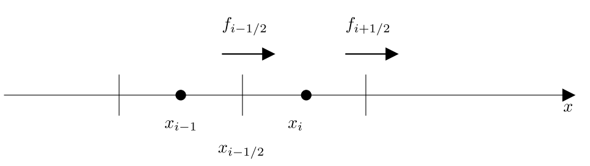

title: 第三章 平流输送
copy_subdir: ../images
---

### 平流输送过程

平流输送对与大气中惰性气体的再分配有着支配性作用，
是空气质量数值模式(CTM)中非常重要的过程。

平流过程的方程通过大气连续性方程得到（对于空气密度就是连续性方程）

  \[ 
    \frac{\partial c}{\partial t} = 
    - \nabla \cdot (\mathbf{v} c) 
    \tag {1.1} \label {1.1}
  \]

 其中\(c\) 表示污染物的浓度（质量浓度，如\(\mu g/m^3\)）

 三维平流过程就是在已知风场（大尺度风场）的情况下，求解大气连续性方程。
 
 当然给定的风场是离散的，同时我们也需要通过数值的方式来解这个方程

 我们通过一个简单推导来理解如何对平流过程进行数值求解。
 
 首先把散度符号展开

 \[
 \frac{\partial c}{\partial t} = 
 - (\frac{\partial (u c)}{\partial x} + 
    \frac{\partial (v c)}{\partial y} + 
    \frac{\partial (w c)}{\partial z})
 \tag {1.2}
 \]

我们考虑一维的平流输送方程
 \[
 \frac{\partial c}{\partial t} = 
 - \frac{\partial (u c)}{\partial x}
 \tag {1.3}
 \]

一维的平流输送方程有两个需要离散化处理的变量 \({\partial x}\) 和 \({\partial t}\) 。在离散化过程中，我们假定空间分辨率为定值。

先对其进行空间上的离散处理。

那么公式可以改写为
\[
   \frac{\partial c_{i}}{\partial t} = 
   \frac{f_{i-1/2}-f_{i+1/2}}{\Delta x}
   \tag {1.4} \label {1.4}
\]

其中\(f_{i-1/2}\) 为格子\(i-1\) 和格子\(i\) 之间的边界(\(i-1/2\)) 处的通量。

\[
    f_{i-1/2} = 
    u_{x_{i-1/2}}^t \times c_{x_{i-1/2}}^t
    \tag {1.5} \label {1.5}
\]

将公式\ref{1.5}带入到公式\ref{1.4}中
\[
   \frac{\partial c_{i}}{\partial t} = 
   \frac
     {u_{x_{i-1/2}}^t \times c_{x_{i-1/2}}^t - 
      u_{x_{i+1/2}}^t \times c_{x_{i+1/2}}^t}
     {\Delta x}
   \tag {1.6} 
\]

WRF等数值模式一般采用荒川网格计算风场，因此\(u_{x_{i-1/2}}^t\)和\(u_{x_{i+1/2}}^t\)为已知量（如果是插值得到，那么可能会存在误差）。

再对时间进行离散化，如果采用简单的显示欧拉方法，则公式变为：

\[
   \frac{c_{x_{i}}^{t+1}-c_{x_{i}}^{t}}{\Delta t} = 
   \frac
     {u_{x_{i-1/2}}^t \times c_{x_{i-1/2}}^t - 
     u_{x_{i+1/2}}^t \times c_{x_{i+1/2}}^t}
     {\Delta x}
   \tag {1.7}
\]

整理一下：

\[
   c_{x_{i}}^{t+1} = c_{x_{i}}^{t} + 
   (\frac
     {u_{x_{i-1/2}}^t \times c_{x_{i-1/2}}^t - 
        u_{x_{i+1/2}}^t \times c_{x_{i+1/2}}^t}
     {\Delta x}) 
   \times 
   {\Delta t}
   \tag {1.8} \label {1.8}
\]

由以上公式可知，平流方案最关键的步骤就是如何获得边界处（stag网格）的浓度（当然最简单的方案就是插值）。

似乎这个公式就能较好的求解出平流对浓度的影响，如果仔细想想，我们会面对四个额外的问题。

首先，我们观察等号右边的中间项（把括号展开, 并稍加整理）
\[
   (\frac
      {u_{x_{i-1/2}}^t \times {\Delta t}} 
      {\Delta x}) 
   \times 
   c_{x_{i-1/2}}^t
   \tag {1.9} \label {1.9}
\]

我们需要意识到，公式\ref{1.9}中存在一个假设，该公司计算的浓度增量是从格子\(i-1\) 吹到格子\(i\) ，注意这个增量会最终叠加在格子\(i\) 中，公式1.8中只涉及到\(c_{x_{i}}\) 的计算，那么有没有一种可能。风速太大了，吹出了格子\(i\) 呢！

当然有可能，所以我们要对数值求解方案施加限制

\[
\frac
      {u_{x_{i-1/2}}^t \times {\Delta t}} 
      {\Delta x}
< 1 \tag {1.10}
\]

这就是 **Courant-Friedrichs-Lewy（CFL）** 条件。

我们在设置\({\Delta x}\) 的时候，应该尽量保证这个条件，这样积分才具有稳定性。

另外一个我们需要关注的问题是数值扩散，由于充分混合的假设，很容易使得平流方案计算的扩散速度大于物理上的实际扩散速度，想像一下一个格子很大，比如 \(81km*81km\) ，从西边界吹入一个高浓度的值，这个高浓度值会瞬间在整个格子里面混合，也就是说这个增量一下就会吹到东边界，肯定比实际扩散的要快一些（因此如何获得边界上的值，是一个比较有挑战的事情，好的方案可以减缓数值扩散）。

然后我们需要关注的事情是质量的一致性，空气质量模式往往采用离线模拟的方式（气象场先模拟，再模拟CTM），并且CTM的网格和原始的气象网格存在差异，不同的离散方案(时间和空间)和插值都会导致质量一致性的出现问题。

为什么空气密度的误差，会影响浓度平流过程计算的质量一致性问题呢？

如果用质量混合比来表示平流方程
设\(C = \frac {c}{\rho}\)

那么(链式法则 => 带入公式\ref{1.1} => 带入C的定义 => 链式法则)
\[
    \frac{\partial C}{\partial t} 
    = 
      \frac{1}{\rho}\frac{\partial c}{\partial t}
      - \frac{c}{\rho^2}\frac{\partial \rho}{\partial t}
    = 
      -\frac{\nabla \cdot (\mathbf{v}c)}{\rho}
      + \frac{c}{\rho^2} {\nabla \cdot (\mathbf{v} \rho)}
\]

\[
    = {-\frac{\nabla \cdot (\rho \mathbf{v}C)
              + C{\nabla \cdot (\mathbf{v} \rho)}}
            {\rho}}
\]

\[
    = -( \mathbf{v} \cdot \nabla C + 
         \frac{C}{\rho} {\nabla \cdot (\mathbf{v} \rho)})
      + \frac{C}{\rho} {\nabla \cdot (\mathbf{v} \rho)}
    = - \mathbf{v} \cdot \nabla C
    \tag {1.11}
\]

注意最终的结论是
\[
    \frac{\partial C}{\partial t} 
    = - \mathbf{v} \cdot \nabla C
    \tag {1.12} \label {1.12} 
\]

要满足质量守恒，公式\ref{1.12}只有唯一的一个解，就是\(C(t) = k\)，其中\(k\) 为常数，也就是说，污染物浓度的变化要和密度变化协调一致（其实很好理解，浓度和空气密度都是同样的方程支配这平流，变化的步调应该是协调一致的）。

最后我们需要关注的事情是质量守恒性，不能因为平流过程的计算，增加或者减少了物质，平流只是把物质从一个地方输送到另一个地方。质量不守恒一般是怎么引发的呢？
